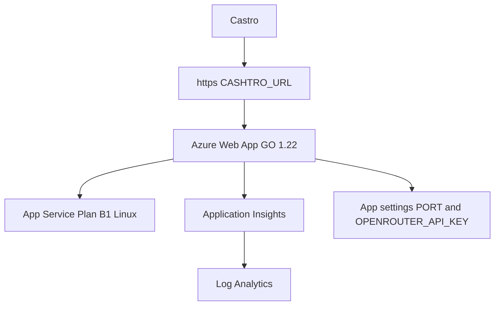

# Azure Deployment Plan

> **Status:** Ready for Validation

Generated: 2026-09-21T20:36:00Z

---

## 1. Project Overview

**Goal:** Put Cashtro OS on Azure App Service (Web Apps) and give Castro a public `https://` link (`CASHTRO_URL`) so the desk can be used immediately.

**Path:** Modernize Existing

---

## 2. Requirements

| Attribute | Value |
|-----------|-------|
| Classification | Development |
| Scale | Small |
| Budget | Cost-Optimized |
| **Subscription** | Team default — Azure MCP `subscription_list` timed out; `azd` uses `AZURE_SUBSCRIPTION_ID` |
| **Location** | canadacentral |

---

## Azure Context

- **Subscription:** team Azure (set with `azd env set AZURE_SUBSCRIPTION_ID`)
- **Location:** canadacentral

---

## 3. Components Detected

| Component | Type | Technology | Path |
|-----------|------|------------|------|
| cashtro | API + desk UI | Go 1.22 stdlib HTTP | `./cmd/cashtro` |

---

## 4. Recipe Selection

**Selected:** AZD (Bicep)

**Rationale:** Default Azure recipe. Target is App Service Web Apps as requested. User-assigned identity, App Insights, Log Analytics, and diagnostic settings included.

---

## 5. Architecture

**Stack:** App Service

### Service Mapping

| Component | Azure Service | SKU |
|-----------|---------------|-----|
| cashtro | App Service Linux (`GO\|1.22`) | B1 |

### Supporting Services

| Service | Purpose |
|---------|---------|
| Log Analytics | Centralized logging + diagnostic settings |
| Application Insights | APM via APPLICATIONINSIGHTS_CONNECTION_STRING |
| User-assigned identity | Least-privilege identity on the web app |
| App settings | PORT, OPENROUTER_API_KEY |

---

## 6. Provisioning Limit Checklist

### Phase 1: Prepare Resource Inventory

| Resource Type | Number to Deploy | Total After Deployment | Limit/Quota | Notes |
|---------------|------------------|------------------------|-------------|-------|
| Microsoft.Resources/resourceGroups | 1 | 1 | 980 / subscription | Official docs. Azure MCP quota CLI unavailable (subscription_list timeout). |
| Microsoft.Web/serverfarms | 1 | 1 | 100 / resource group | Official App Service limits. Greenfield assumed. |
| Microsoft.Web/sites | 1 | 1 | 100 / plan | Official App Service limits. |
| Microsoft.Insights/components | 1 | 1 | 500 / subscription | Official Azure Monitor limits. |
| Microsoft.OperationalInsights/workspaces | 1 | 1 | 5000 / subscription | Official Azure Monitor limits. |
| Microsoft.ManagedIdentity/userAssignedIdentities | 1 | 1 | 2000 / subscription | Official docs. |

**Status:** ✅ All resources within limits (official docs fallback; Azure quota CLI not reachable from this agent)

---

## 7. Execution Checklist

### Phase 1: Planning
- [x] Analyze workspace
- [x] Gather requirements
- [x] Confirm subscription and location (canadacentral; team subscription via azd env)
- [x] Prepare resource inventory
- [x] Fetch quotas and validate capacity
- [x] Scan codebase
- [x] Select recipe
- [x] Plan architecture
- [x] User approved Azure Web Apps deployment

### Phase 2: Execution
- [x] Research components (App Service Bicep, AZD IaC rules, deploy_iac_rules_get)
- [x] Confirm Azure context (canadacentral; team keys not present in this VM)
- [x] Generate infrastructure files
- [x] Generate application configuration (PORT, azure.yaml)
- [x] Generate Dockerfile
- [x] Update plan status to Ready for Validation

### Phase 3: Validation
- [x] Plan status Ready for Validation
- [ ] Invoke azure-validate (local go test + bicep if available)
- [ ] All validation checks pass
- [ ] Update plan status to Validated

### Phase 4: Deployment
- [ ] Invoke azure-deploy
- [ ] Deployment successful
- [ ] Report deployed endpoint URLs

---

## 7. Validation Proof

| Check | Command Run | Result | Timestamp |
|-------|-------------|--------|-----------|
| | | | |

**Validated by:** pending
**Validation timestamp:**

---

## 8. Files to Generate

| File | Purpose | Status |
|------|---------|--------|
| `.azure/deployment-plan.md` | This plan | ✅ |
| `azure.yaml` | AZD configuration | ✅ |
| `infra/main.bicep` | Subscription-scoped entry | ✅ |
| `infra/modules/resources.bicep` | App Service + monitor | ✅ |
| `Dockerfile` | Container fallback | ✅ |

---

## 9. Next Steps

> Current: Ready for Validation — run tests, then azd up on the team subscription

## IaC rule report

- AZD entry is subscription-scoped `infra/main.bicep` + `main.parameters.json`
- Resource token is `uniqueString(subscription().id, location, environmentName)`
- App Service resources use `az{prefix}{token}` names
- User-assigned managed identity is attached to the web app
- APPLICATIONINSIGHTS_CONNECTION_STRING is set
- CORS is enabled (`allowedOrigins: *`)
- Diagnostic settings write HTTP/console/app logs to Log Analytics
- App Service Plan `reserved: true` (Linux)
- `azd-service-name: cashtro` tag is on the site
- Key Vault skipped (no database dependency; OpenRouter key is an App Setting)
