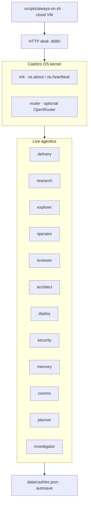

# Cashtro agentic OS map

When explaining the agentic OS, fleet hierarchy, progress, architecture, or multi-agent structure for Castro: **never text-only**. Open or update a canvas and/or include Mermaid.

## Default Mermaid (update counts from `/api/os`)

## What to show

- Kernel vs live vs resident (router unbound = resident)
- Delivery line: idea → concept → production
- Durability: disk image + always-on + overnight timer
- One sentence of progress (version + last capability), not a dashboard dump

## Canvas

Prefer `canvases/agentic-os-plan.canvas.tsx` when a Cursor canvas is available. Keep any `~/.cursor/admiral-fleet` STATUS/PLAN/ROSTER aligned if that tree exists in the environment.

## Do not

- Explain fleet/OS architecture as a long prose-only reply
- Overlay unrelated marketing/dashboard chrome on the map
