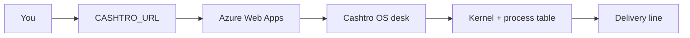

# Cashtro Builder

Scrum Master & Software Engineer · Founder · FR/EN · Remote worldwide

**I make teams ship: idea → concept → production.**

The delivery operation lives at [**Evolu-Jeunes**](https://github.com/Evolu-Jeunes) —
48 repos, 30+ platforms shipped for law firms, clinics, finance and
e-commerce. Client code stays private. The results are live:

- ⚖️ BTK Avocats — law firm platform (WordPress)
- 🏥 MD Clinic — medical clinic (WordPress/ACF)
- 🏦 Solution Hypothèque QC — mortgage services
- 🎓 Éduconnexion — education platform
- 🚀 Proximity — agency platform (Next.js/TypeScript + Azure APIs)
- 🤖 ScanApp, CRM, AI bots — TypeScript & Python builds

**Stack:** Go · PHP/WordPress · React/Next.js/TypeScript · Python · Azure

**Team:** 75+ developers trained on real client mandates

📩 alejandro@proximityagency.ca

---

## Cashtro OS

**Start using it:** after `azd up`, open the printed `CASHTRO_URL`
(https://azapp….azurewebsites.net). Local desk: [http://localhost:8080](http://localhost:8080).



This repo is **under construction**. It is the control plane for every
agentic we build here. Agents are processes. Capabilities are verbs.
Mail, notes, memory, and human confirms are first-class. Delivery and
research are live. New agentics register into this kernel — they do not
become a second product.

```bash
go test ./...
go run ./cmd/cashtro
```

Open `http://localhost:8080`.

### Azure Web Apps

The desk is meant to live on Azure App Service, not only on localhost.

```bash
azd auth login
azd env new cashtro --no-prompt
azd env set AZURE_LOCATION canadacentral
azd env set AZURE_SUBSCRIPTION_ID <team-subscription-id>
# optional — kernel boots without it
azd env set OPENROUTER_API_KEY "$OPENROUTER_API_KEY"
azd up --no-prompt
azd env get-values   # CASHTRO_URL / WEB_URL
```

`OPENROUTER_API_KEY` is an App Setting. The kernel stays live if the key is missing.

### Do we need OpenRouter?

**No, not to boot.** The kernel, process table, delivery board, and journal
run with zero model keys.

**Yes, if an agentic needs to think.** OpenRouter is the optional model bus:
one key, many models. Bind it when you want `model.chat` to execute.

```bash
export OPENROUTER_API_KEY=sk-or-...
export OPENROUTER_MODEL=openai/gpt-4o-mini   # optional
go run ./cmd/cashtro
```

Without a key the `router` process stays **resident** and tells you it is
unbound. The rest of the OS stays live.

| Method | Path | What it does |
| --- | --- | --- |
| `GET` | `/` | OS desk |
| `GET` | `/health` | Liveness + kernel counts |
| `GET` | `/api/os` | Manifesto and process counts |
| `GET` | `/api/agents` | Process table |
| `POST` | `/api/agents/{id}/invoke` | Run a capability |
| `GET` | `/api/model` | OpenRouter bind card |
| `GET` | `/api/notes` | Research library |
| `POST` | `/api/notes` | Ingest a sourced finding |
| `GET` | `/api/mail` | Agent mailbox |
| `GET` | `/api/memory` | Episodic recall |
| `GET` | `/api/confirms` | Human gate |
| `GET` | `/api/ships` | Delivery line |
| `POST` | `/api/ships` | Park a mandate in idea |
| `POST` | `/api/ships/{id}/advance` | Move one stage right |
