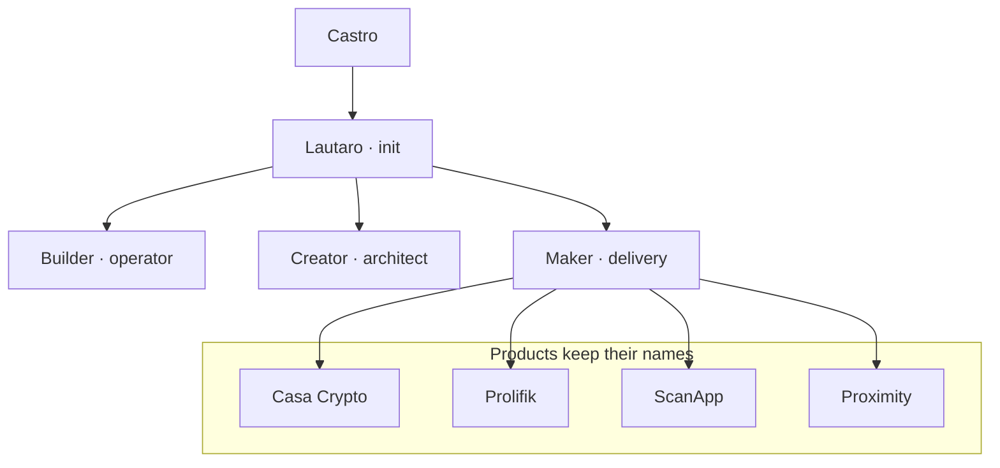

# Agentic OS plan — builders vs products

Castro rule: **products stay products**. Processes wear names like
**Builder**, **Creator**, **Lautaro** — then the rest of the crew.

See `~/.cursor/admiral-fleet/ROSTER.md` for the live roster.

