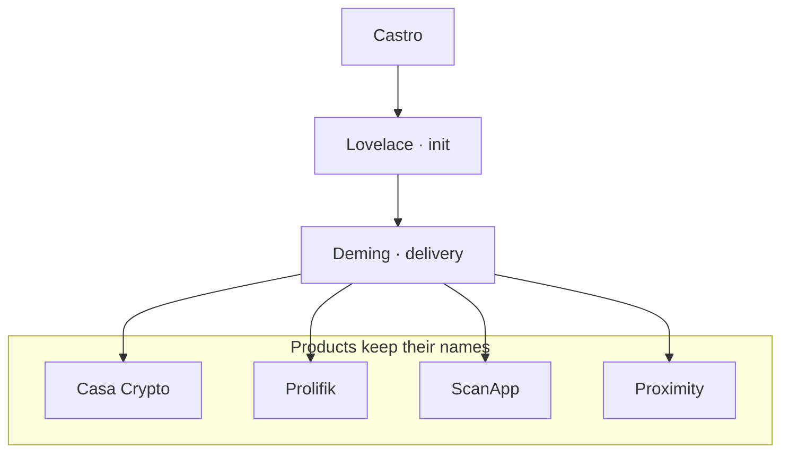

# Agentic OS plan — thinkers vs products

Castro rule: **products stay products**. Processes wear well-known thinkers.

See `~/.cursor/admiral-fleet/ROSTER.md` for the live roster.

```mermaid
flowchart TB
  Castro[Castro]
  Lovelace[Lovelace · init]
  Deming[Deming · delivery]
  subgraph products [Products keep their names]
    CasaCrypto[Casa Crypto]
    Prolifik[Prolifik]
    ScanApp[ScanApp]
    Proximity[Proximity]
  end
  Castro --> Lovelace
  Lovelace --> Deming
  Deming --> CasaCrypto
  Deming --> Prolifik
  Deming --> ScanApp
  Deming --> Proximity
```
