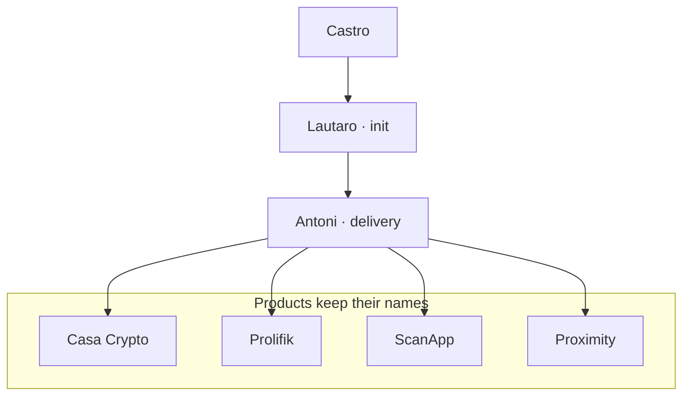

# Agentic OS plan — builders vs products

Castro rule: **products stay products**. Processes wear builder / creator
names like **Lautaro**.

See `~/.cursor/admiral-fleet/ROSTER.md` for the live roster.

