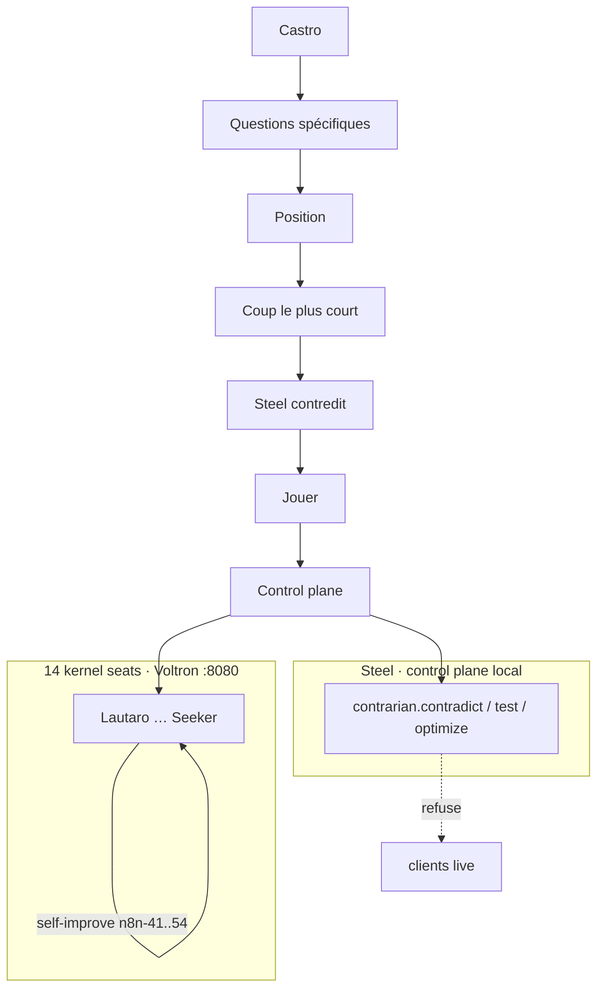

# Corporation — 14 kernel + Steel

Comprendre avant de positionner. Chaque département comble **sa** lacune.
Steel contredit vers l’option plus courte. Pas un second OS.

Source of truth: `state/corporation.json`. Pane: `/ui/corp`. API: `GET /corp`.

## Why Steel is not process 15 tonight

Voltron overnight stays at **14**. Do not kill `:8080`.
Steel runs as `runtime=contrarian` locally. Kernel bind waits for a
planned restart.

## Each department

| Crew | Seat | Lacune (short) |
| --- | --- | --- |
| Lautaro | init | Manifesto without a silent-seat check |
| Maker | delivery | Advance without owner / kill / live fence |
| Spark | router | Chat when a local verb would do |
| Scribe | research | Ingest without naming the hole |
| Pathfinder | explorer | Hits without unseen owners |
| Builder | operator | Health probe, no repair of a silent pane |
| Witness | reviewer | Watches **after**. Steel is **before**. |
| Creator | architect | Plan without a cheaper rejected plan |
| Forger | deploy | Refuse-prod flag, not a promote test |
| Sentinel | security | Lists holes, does not stop the dispatch |
| Keeper | memory | Kernel memory dies on reboot |
| Herald | comms | Send without Steel |
| Steward | planner | Backlog without a seat owner |
| Seeker | investigator | Happy path without a contradiction |
| **Steel** | contrarian | Did not exist |

Live clients stay catalog-only. Steel fails closed if they appear in a task.
