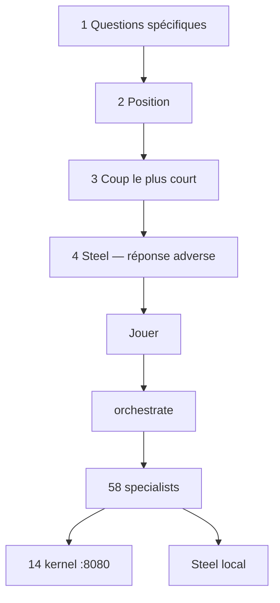

# Coup — questions d’abord, puis on joue

Avant chaque action : des **questions spécifiques** pour combler le
contexte, la position, le coup le plus court, **Steel**. Ensuite seulement on joue.

Le pane Fastify ne dispatch plus d’un clic. L’API JSON `/tasks/:id/dispatch` reste pour les tests et le CI.

## Pane

1. Queue → lien **Coup** → `GET /ui/coup/:id`
2. Le formulaire propose les questions du département matché (`state/corporation.json`)
3. Le premier champ doit contenir un `?`
4. **Jouer** poste `POST /ui/act/dispatch/:id`
5. Incomplet → `?missing=1`
6. Complet → événement `coup.before`, puis orchestrate
7. Si le siège est Steel → adapter local `$0`, refuse live clients

## Ce que ça n’est pas

- Pas une partie d’échecs
- Pas un second produit
- Pas un gate sur l’API JSON
- Kill switch Pause reste un clic
