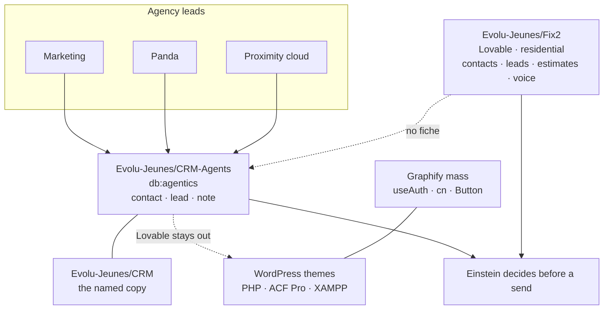

# Critique of every CRM

Two GitHubs, three named books, and one clone field that Graphify counted as most of the map. The kernel can name each book. It does not write a customer row.

## The books

| Book | Repo | Database | Who it holds | What this kernel does |
|---|---|---|---|---|
| Agent carnet | `Evolu-Jeunes/CRM-Agents` | `db:agentics` | Every conglomerate line except Fix Tout | Remembers a draft. Send stays refused. |
| Copy named CRM | `Evolu-Jeunes/CRM` | unnamed | Named as the copy of the agent carnet, and also listed on the Fix Tout line | No writer in this kernel. |
| Fix Tout | `Evolu-Jeunes/Fix2` | `Evolu-Jeunes/Fix2` | Residential handyman clients | A Fix Tout line is refused by `CRMGrow`. |
| Clone field | repeated across client sites | unread | `useAuth`, `cn`, `Button`, plus WordPress | Graphify nodes. Not a fourth customer book. |

Voice on the two live books is Vapi. A call is not placed from this process. `Writes`, `Sent`, and `Dialed` are false on both.

## Graphic

## Agent carnet

`CRM()` is `Evolu-Jeunes/CRM-Agents`, app Agentics, host local. It gathers `contact`, `lead`, and `note`. Its modules are messages, leads, and marketing. Marketing, Panda, and Proximity cloud pass leads here. A draft is remembered on the kernel under `agentics:<line>`. An empty title on `manager.crm` returns this book. A title files a brouillon. `send: true` returns "envoi refusé". A secret shape in the title or body is filtered. Einstein is `DecidedBy`.

The lines it will file are control, wordpress, proximity, scanapp, marketplace, panda, nft-giant, ecole, marketing, empire, propres, trading, and fonds. A WordPress note is the site name and the client name. A Giant note is art or a token reading. A fonds note is a ledger note. An order, a checkout, a transfer, and a theme edit stay parked.

## Evolu-Jeunes/CRM

This repo is the `Copy` of the agent carnet. The Fix Tout line also lists `Evolu-Jeunes/CRM` beside `Evolu-Jeunes/Fix2`. One name currently means the agent copy and a Fix Tout repo. A reader cannot tell which database that string opens. That is the sharpest defect in the naming.

## Fix Tout

`Fix2CRM()` is the Lovable book. One line: `fix2`. Modules: contacts, leads, estimates, voice. The mandate says the site keeps every client, Vapi reads only that base, and forty agents sit on that voice. Those forty are not among the fifteen kernel processes. `CRMGrow` refuses the line with "Fix Tout tient le CRM Lovable". The link `fix2 → marketing` says no fiche crosses.

## The clone field

Graphify, login cashtro, organization Evolu-Jeunes: 63 repos, 7,075 code files, 52,527 nodes, 133,783 edges. Most of those nodes are the same CRM screen copied again: `useAuth`, `cn`, `Button`, and WordPress. Counting each copy as its own CRM sends the cartographer to the wrong building. The WordPress line is PHP, ACF Pro, and XAMPP. Lovable stays out of those themes.

## What holds

Client rows for the handyman stay on `Evolu-Jeunes/Fix2`. Agency leads stay on `Evolu-Jeunes/CRM-Agents`. A secret does not enter a draft. A send and a call wait for Einstein. This kernel does not write Supabase.

## What is weak

Both live books use the same three verbs and the same voice, and neither book has a row the other is allowed to see. A job that starts in one book has no object the other book can read.

`Evolu-Jeunes/CRM` is doing two jobs in the names we already store.

The kernel CRM is a policy and a memory. The customer systems live in the repos. This critique does not include their tables. The extract still has 674 unread `.sql` files, 115 unread `.ejs` files, and 97 syntax-partial files.

The Fix Tout mandate names forty agents. The process table does not.

## Open

A referral would name the job and leave the client row where it already lives. That object is not in the kernel yet.
