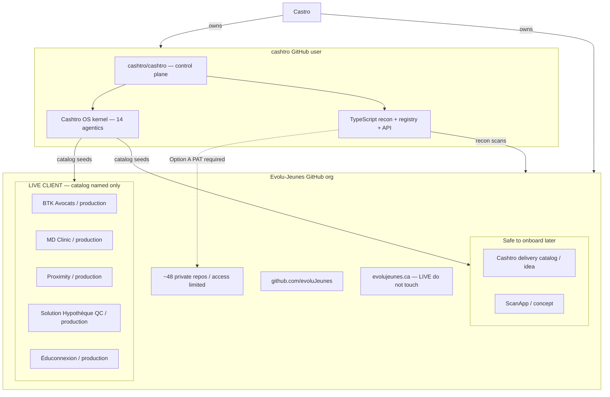

# Cashtro × Evolu-Jeunes

Cashtro is the public control plane. Evolu-Jeunes is the private delivery org. They are one fleet under Castro. Client production stays dark.

Open on the desk: [`http://127.0.0.1:8080/map`](http://127.0.0.1:8080/map) · JSON: [`/api/map`](http://127.0.0.1:8080/api/map).

| Place | URL |
| --- | --- |
| cashtro/cashtro | https://github.com/cashtro/cashtro |
| Evolu-Jeunes org | https://github.com/Evolu-Jeunes |
| evoluJeunes member | https://github.com/evoluJeunes |
| evolujeunes.ca | https://evolujeunes.ca |
| Desk map | http://127.0.0.1:8080/map |
| Markdown map | https://github.com/cashtro/cashtro/blob/main/docs/FLEET_MAP.md |

## What is reachable today

- **cashtro/cashtro** — public control plane. Go kernel, Voltron, recon, registry, API.
- **Evolu-Jeunes** — org exists, **0 public repos**. Token cannot list the private fleet.
- **evoluJeunes** — public org member.
- **evolujeunes.ca** — live nonprofit site. Do not touch.

## Catalog ships (not GitHub-scanned)

These names come from `internal/catalog`. Recon did not open their repos.

- **Cashtro delivery catalog** · idea · safe to onboard later
- **ScanApp** · concept · safe to onboard later
- **BTK Avocats** · production · **LIVE CLIENT — do not touch**
- **MD Clinic** · production · **LIVE CLIENT — do not touch**
- **Proximity** · production · **LIVE CLIENT — do not touch**
- **Solution Hypothèque QC** · production · **LIVE CLIENT — do not touch**
- **Éduconnexion** · production · **LIVE CLIENT — do not touch**

## Hard stop

Do not guess private repo slugs. After Option A (`docs/ACCESS_REQUIRED.md`), re-run `pnpm recon` and this map gains real Evolu-Jeunes trees.
