# Epicenter — schema Mermaid

Graphify reste la map vivante. Ce schema Mermaid nomme les deux voies (Ollama interne, Kimi K3 et GLM 5.3 max), les 5 cerveaux, leurs sous-cerveaux et les 58 projets.

```mermaid
%%{init: {'theme':'dark','flowchart':{'htmlLabels':true,'nodeSpacing':18,'rankSpacing':28}}}%%
flowchart TB
  manager["MANAGER<br/>Epicenter · 58 projets"]
  subgraph lanes["Les deux voies"]
    ollama["Ollama interne<br/>llama3.2"]
    kimi["Kimi K3<br/>moonshotai/kimi-k3"]
    glm["GLM 5.3 max<br/>z-ai/glm-5.3"]
  end
  manager --> ollama
  manager --> kimi
  manager --> glm
  kimi --- glm
  manager --> architecte["L'Architecte<br/>pense · ML/DL"]
  subgraph sub_architecte["L'Architecte · sous-cerveaux"]
    architecte_s1["Meta-Cerveau"]
    architecte_s2["Relativite"]
    architecte_s3["Geomatria"]
    architecte_s4["Marche"]
    architecte_s5["Tisseur"]
  end
  architecte --> architecte_s1
  subgraph repos_architecte["L'Architecte · projets"]
    cashtro_PBTM["PBTM<br/>cashtro"]
    Evolu_Jeunes_AI_BOT["AI-BOT<br/>Evolu"]
    Evolu_Jeunes_bot["bot<br/>Evolu"]
    Evolu_Jeunes_sigma["sigma<br/>Evolu"]
    Evolu_Jeunes_sigmaNew["sigmaNew<br/>Evolu"]
  end
  architecte --> cashtro_PBTM
  manager --> cartographe["Le Cartographe<br/>voit · Graphify"]
  subgraph sub_cartographe["Le Cartographe · sous-cerveaux"]
    cartographe_s1["Planificateur"]
    cartographe_s2["Mappeur"]
    cartographe_s3["Graphifieur"]
    cartographe_s4["Moniteur"]
    cartographe_s5["Philosophe"]
  end
  cartographe --> cartographe_s1
  subgraph repos_cartographe["Le Cartographe · projets"]
    cashtro_cashtro["cashtro<br/>cashtro"]
    cashtro_epicenter["epicenter<br/>cashtro"]
    Evolu_Jeunes_Api_Proximity["Api-Proximity<br/>Evolu"]
    Evolu_Jeunes_demo_repository["demo-repository<br/>Evolu"]
    Evolu_Jeunes_educonnexion["educonnexion<br/>Evolu"]
    Evolu_Jeunes_Proximity_Agentic["Proximity-Agentic<br/>Evolu"]
  end
  cartographe --> cashtro_cashtro
  manager --> forgeron["Le Forgeron<br/>construit 24/7"]
  subgraph sub_forgeron["Le Forgeron · sous-cerveaux"]
    forgeron_s1["Soudeur"]
    forgeron_s2["Mecanicien"]
    forgeron_s3["Tisserand"]
    forgeron_s4["Mineur"]
    forgeron_s5["Ambassadeur"]
  end
  forgeron --> forgeron_s1
  subgraph repos_forgeron["Le Forgeron · projets"]
    cashtro_H2OriginTest["H2OriginTest<br/>cashtro"]
    Evolu_Jeunes_h20["h20<br/>Evolu"]
    Evolu_Jeunes_h20landing["h20landing<br/>Evolu"]
    Evolu_Jeunes_H2oH2o["H2oH2o<br/>Evolu"]
    Evolu_Jeunes_lanordique["lanordique<br/>Evolu"]
    Evolu_Jeunes_MtlEvolution["MtlEvolution<br/>Evolu"]
    Evolu_Jeunes_Newnordique["Newnordique<br/>Evolu"]
    Evolu_Jeunes_noix["noix<br/>Evolu"]
    Evolu_Jeunes_Noix_landing["Noix_landing<br/>Evolu"]
    Evolu_Jeunes_nordiqueweb["nordiqueweb<br/>Evolu"]
    Evolu_Jeunes_Plugin["Plugin<br/>Evolu"]
    Evolu_Jeunes_Proximity["Proximity<br/>Evolu"]
    Evolu_Jeunes_ProximityApp["ProximityApp<br/>Evolu"]
    Evolu_Jeunes_Proxy["Proxy<br/>Evolu"]
    Evolu_Jeunes_ScanApp["ScanApp<br/>Evolu"]
  end
  forgeron --> cashtro_H2OriginTest
  manager --> orfevre["L'Orfevre<br/>execute 24/7"]
  subgraph sub_orfevre["L'Orfevre · sous-cerveaux"]
    orfevre_s1["Controleur"]
    orfevre_s2["Livreur"]
    orfevre_s3["Polisseur"]
    orfevre_s4["Documenteur"]
    orfevre_s5["Diplomate"]
  end
  orfevre --> orfevre_s1
  subgraph repos_orfevre["L'Orfevre · projets"]
    Evolu_Jeunes_Alaska["Alaska<br/>Evolu"]
    Evolu_Jeunes_Al_Soudani["Al-Soudani<br/>Evolu"]
    Evolu_Jeunes_AsselinCPA["AsselinCPA<br/>Evolu"]
    Evolu_Jeunes_AstroPoulet["AstroPoulet<br/>Evolu"]
    Evolu_Jeunes_Btkavocat["Btkavocat<br/>Evolu"]
    Evolu_Jeunes_bubbles["bubbles<br/>Evolu"]
    Evolu_Jeunes_clic["clic<br/>Evolu"]
    Evolu_Jeunes_Corps_Art["Corps-Art<br/>Evolu"]
    Evolu_Jeunes_CPA["CPA<br/>Evolu"]
    Evolu_Jeunes_CRM["CRM<br/>Evolu"]
    Evolu_Jeunes_Decoland["Decoland<br/>Evolu"]
    Evolu_Jeunes_Expertise["Expertise<br/>Evolu"]
    Evolu_Jeunes_Giant["Giant<br/>Evolu"]
    Evolu_Jeunes_GroulxGroulx["GroulxGroulx<br/>Evolu"]
    Evolu_Jeunes_hypotheque["hypotheque<br/>Evolu"]
    Evolu_Jeunes_Hypotheque_ca["Hypotheque.ca<br/>Evolu"]
    Evolu_Jeunes_immobilier["immobilier<br/>Evolu"]
    Evolu_Jeunes_MB_Health["MB-Health<br/>Evolu"]
    Evolu_Jeunes_MD_clinic["MD-clinic<br/>Evolu"]
    Evolu_Jeunes_multiservices["multiservices<br/>Evolu"]
    Evolu_Jeunes_Neuro_equilibre["Neuro-equilibre<br/>Evolu"]
    Evolu_Jeunes_Nhl["Nhl<br/>Evolu"]
    Evolu_Jeunes_Panda["Panda<br/>Evolu"]
    Evolu_Jeunes_Pollo["Pollo<br/>Evolu"]
  end
  orfevre --> Evolu_Jeunes_Alaska
	manager --> hustler["Le Hustler<br/>empire A a Z"]
	manager --> inquisitor["L'Inquisiteur<br/>contredit · teste · bloque · smarter"]
	inquisitor --> hustler
	inquisitor --> architecte
	inquisitor --> cartographe
	inquisitor --> forgeron
	inquisitor --> orfevre
  subgraph sub_hustler["Le Hustler · sous-cerveaux"]
    hustler_s1["Strategue"]
    hustler_s2["Traqueur"]
    hustler_s3["Recruteur"]
    hustler_s4["Empire"]
    hustler_s5["Pontife"]
  end
  hustler --> hustler_s1
  subgraph repos_hustler["Le Hustler · projets"]
    cashtro_Pandora["Pandora<br/>cashtro"]
    cashtro_trading_bot_main["trading_bot-main<br/>cashtro"]
    Evolu_Jeunes_Blockchain_Trading_["Blockchain-Trading-<br/>Evolu"]
    Evolu_Jeunes_Empire_["Empire-<br/>Evolu"]
    Evolu_Jeunes_EmpireMedia["EmpireMedia<br/>Evolu"]
    Evolu_Jeunes_Nft["Nft<br/>Evolu"]
    Evolu_Jeunes_Pandora["Pandora<br/>Evolu"]
    Evolu_Jeunes_TradingBotCodex["TradingBotCodex<br/>Evolu"]
  end
  hustler --> cashtro_Pandora
  manager --> teal["Teal<br/>corporate brain · Teams ingest"]
  manager --> vapi["Vapi<br/>voice lane · all bridges"]
  subgraph sub_teal["Teal · voix et stagiaires"]
    vapi_desk["talk · call · voice picker"]
    teams_ai["Teams AI Teal<br/>scrape + cards"]
    cursor_app["Cursor app<br/>cursor.com/agents"]
    intern_desk["Intern desk"]
  end
  teal --> vapi
  vapi --> vapi_desk
  teal --> teams_ai
  teal --> cursor_app
  teal --> intern_desk
  teal --> cashtro_Pandora
  vapi --> Evolu_Jeunes_Proximity
  vapi --> Evolu_Jeunes_ScanApp
  vapi --> Evolu_Jeunes_Panda
  vapi --> Evolu_Jeunes_Nft
  vapi --> Evolu_Jeunes_educonnexion
  vapi --> Evolu_Jeunes_CRM
  vapi --> Evolu_Jeunes_EmpireMedia
  vapi --> Evolu_Jeunes_AI_BOT
  vapi --> cashtro_Pandora
  manager --> evolu_teal["Evolu-Jeunes/Teal<br/>fresh voice repo · :8090"]
	vapi --> evolu_teal
	teal --> evolu_teal
	inquisitor --> teal
	inquisitor --> vapi
	inquisitor --> evolu_teal
  Evolu_Jeunes_Proximity -.-> Evolu_Jeunes_ProximityApp
  Evolu_Jeunes_Proximity -.-> Evolu_Jeunes_Proximity_Agentic
  Evolu_Jeunes_h20 -.-> Evolu_Jeunes_H2oH2o
  Evolu_Jeunes_h20 -.-> cashtro_H2OriginTest
  Evolu_Jeunes_hypotheque -.-> Evolu_Jeunes_Hypotheque_ca
  Evolu_Jeunes_lanordique -.-> Evolu_Jeunes_nordiqueweb
  Evolu_Jeunes_sigma -.-> Evolu_Jeunes_sigmaNew
  Evolu_Jeunes_Blockchain_Trading_ -.-> cashtro_trading_bot_main
  Evolu_Jeunes_Pandora -.-> cashtro_Pandora
  cashtro_cashtro -.-> cashtro_epicenter
  cashtro_epicenter -.-> Evolu_Jeunes_Proximity_Agentic
```

