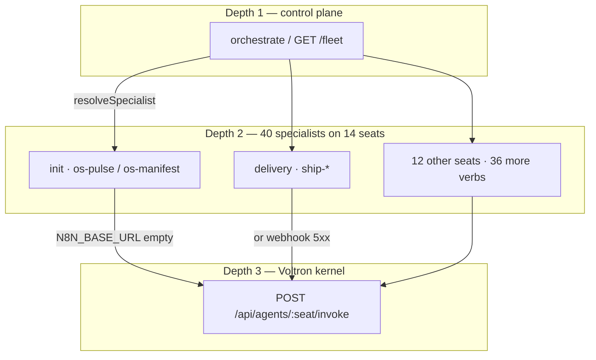

# n8n fabric — same agents, 40 specialists

n8n is **not** a second product. It is the workflow fabric on the
existing 14 Voltron seats. Width 40. Depth still 3.



## Unbound tonight

`N8N_BASE_URL` empty → adapter posts nowhere and falls back to
`http://127.0.0.1:8080/api/agents/:seat/invoke`. The 40 workers still
exist in the registry (`GET /fleet`).

## Bind later (local only)

```bash
docker compose -f docker-compose.n8n.yml up -d
# .env
N8N_BASE_URL=http://127.0.0.1:5678
```

Do not buy n8n Cloud. Do not point a workflow at a live client site.

## Map

See `state/n8n-fleet.json`. Forty rows, each `{ seat, name, capability, webhook }`.
