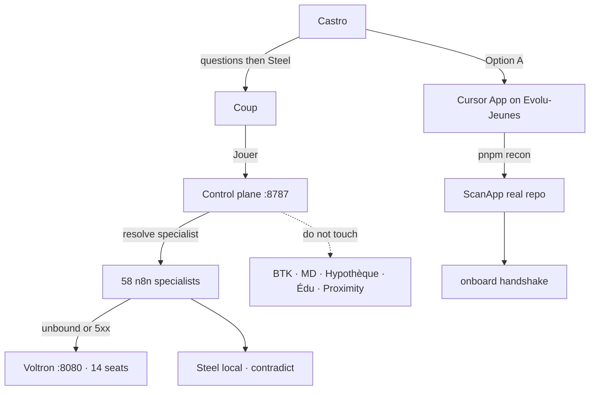

# ROADMAP — Graphify guide

One OS. Width, not a second product. Depth hard-stop 3.

## Done

- Phase 0–3: recon, registry, Fastify API
- Phase 4–7: adapters, onboard cashtro, costs, `/ui`
- Six seats bound locally. Router resident until a key
- Overnight Voltron watch
- n8n fabric: 58 specialists on 14 kernel seats + Steel

## Gate — Castro

Install the **Cursor GitHub App** on **Evolu-Jeunes** with **All repositories**.
Connecting Cursor desktop is not enough. See `docs/ACCESS_REQUIRED.md`.

## Next — after the gate

1. `pnpm recon` — inventory grows; do not invent slugs
2. Attach ScanApp `repoUrl` when recon finds it
3. Merge `inventory/drafts/scanapp/agent.manifest.json`
4. Keep live clients catalog-only

## Optional — still local

- `docker compose -f docker-compose.n8n.yml up -d` then `N8N_BASE_URL=http://127.0.0.1:5678`
- `OPENROUTER_API_KEY` only if a seat must think
- No n8n Cloud. No paid Redis. No prod deploy

## Later — named only

Axel, Happier, wealth. Graphify named them. No repo path until recon sees one.
