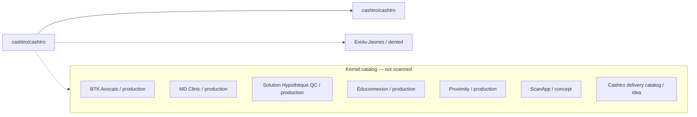

# Inventory graph

```mermaid
flowchart LR
  manager[cashtro/cashtro]
  cashtro[cashtro/cashtro]
  manager --> cashtro
  Evolu_Jeunes_dark[Evolu-Jeunes / denied]
  manager -.-> Evolu_Jeunes_dark
  subgraph catalog[Kernel catalog — not scanned]
    cat_BTK_Avocats[BTK Avocats / production]
    cat_MD_Clinic[MD Clinic / production]
    cat_Solution_Hypoth_que_QC[Solution Hypothèque QC / production]
    cat__duconnexion[Éduconnexion / production]
    cat_Proximity[Proximity / production]
    cat_ScanApp[ScanApp / concept]
    cat_Cashtro_delivery_catalog[Cashtro delivery catalog / idea]
  end
  manager -.-> catalog
```
