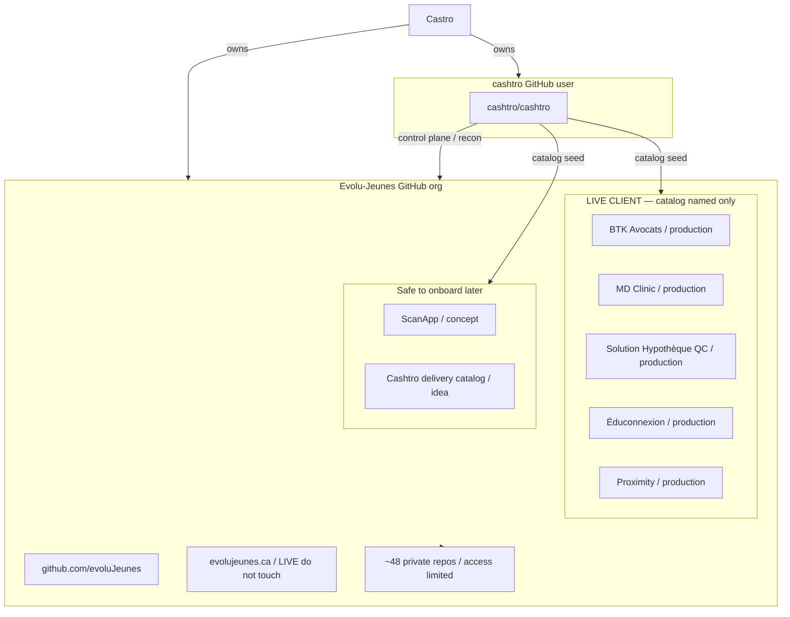

# Inventory graph

Cashtro (control plane) and Evolu-Jeunes (delivery org) mapped together.
Live client ships are catalog-named only. Do not touch production.
Canonical desk map: `GET /map` · JSON `GET /api/map` · `docs/FLEET_MAP.md`.

