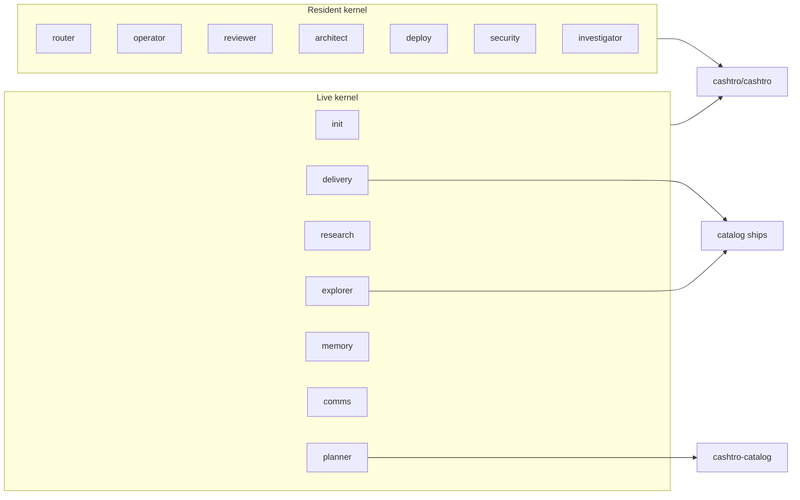

# Inventory graph

Generated 2026-09-22. Graphify extracts `internal/fleet` (`Worked` calls)
and the wikilinked notes under `inventory/fleet/`. Rebuild the map with
`python3 tools/graphify-fleet/build.py`, then `graphify extract . --code-only`.

Reachable GitHub: **cashtro/cashtro** (196 cloud runs, 14 kernel agentics).
Evolu-Jeunes and live client ships are catalog-named only.

```mermaid
flowchart TB
  subgraph manager[cashtro/cashtro — reachable]
    kernel[14 kernel agentics]
    cloud[100 cloud run families / 196 runs]
    cp[Control plane API + recon]
  end

  subgraph live[Catalog ships — LIVE CLIENT do not touch]
    btk[BTK Avocats]
    md[MD Clinic]
    hypo[Solution Hypothèque QC]
    edu[Éduconnexion]
    prox[Proximity]
  end

  subgraph later[Safe to onboard later]
    scan[ScanApp]
    cat[Cashtro delivery catalog]
  end

  subgraph named[Named by cloud work — not in kernel catalog]
    axel[Axel brand AI bot]
    happier[Happier non-profit]
    wealth[Wealth / trading]
    n8n[Internal n8n desk]
  end

  dark[Evolu-Jeunes / denied]

  kernel --> manager
  cloud --> manager
  cp --> manager

  kernel -->|delivery + explorer| live
  kernel -->|delivery + explorer| later
  kernel -->|planner| cat

  cloud -->|all families| manager
  cloud -->|Scan app readiness| scan
  cloud -->|Teams / Proximity| prox
  cloud -->|Axel brand AI bot| axel
  cloud -->|Happier program| happier
  cloud -->|wealth + trading| wealth
  cloud -->|n8n desk| n8n
  cloud -->|Grapiphy agent project scope| live
  cloud -->|Grapiphy agent project scope| later
  cloud -->|Grapiphy agent project scope| named
  cloud -.->|Grapiphy scope — no GitHub access| dark

  manager -.-> dark
  manager -.-> live
```





See `inventory/agent-project-map.json` for every edge, including each
cloud family's `bcId` list. Query the extracted graph:

```bash
graphify explain ScanappProject
graphify explain GrapiphyAgentProjectScopeAgent
graphify path ScanappProject CashtroProject --undirected
graphify query "Worked CashtroProject DeliveryAgent"
```

