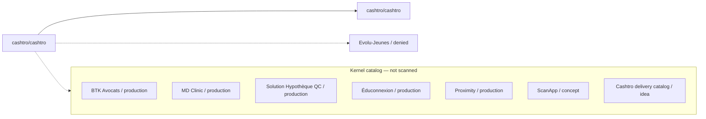
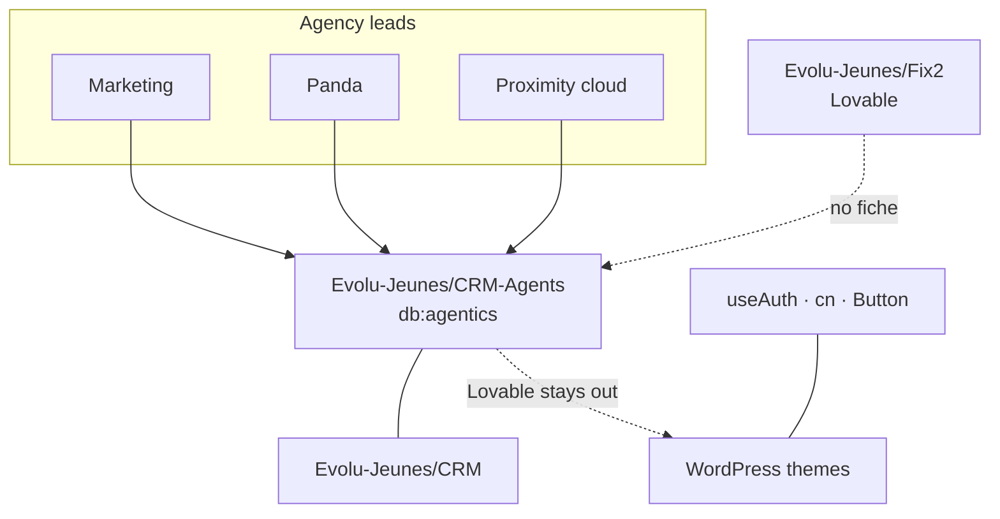
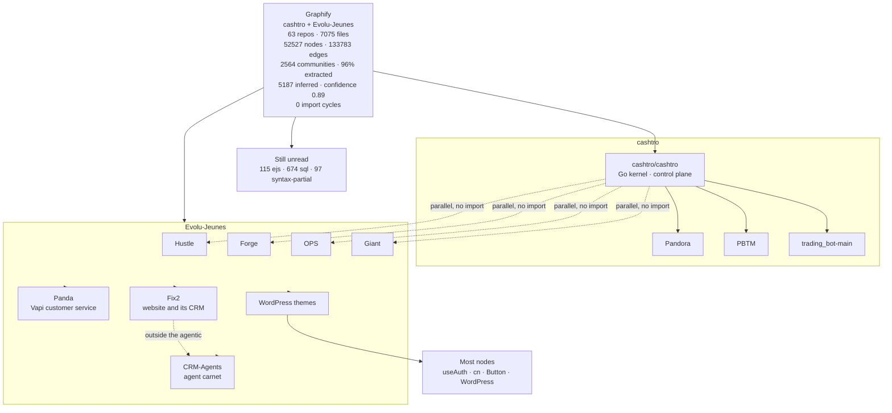

# Inventory graph

```mermaid
flowchart LR
  manager[cashtro/cashtro]
  cashtro[cashtro/cashtro]
  manager --> cashtro
  Evolu_Jeunes_dark[Evolu-Jeunes / denied]
  manager -.-> Evolu_Jeunes_dark
  subgraph catalog[Kernel catalog — not scanned]
    cat_BTK_Avocats[BTK Avocats / production]
    cat_MD_Clinic[MD Clinic / production]
    cat_Solution_Hypoth_que_QC[Solution Hypothèque QC / production]
    cat__duconnexion[Éduconnexion / production]
    cat_Proximity[Proximity / production]
    cat_ScanApp[ScanApp / concept]
    cat_Cashtro_delivery_catalog[Cashtro delivery catalog / idea]
  end
  manager -.-> catalog
```

## CRM books

```mermaid
flowchart TB
  subgraph agency [Agency leads]
    marketing[Marketing]
    panda[Panda]
    proximity[Proximity cloud]
  end
  agents["Evolu-Jeunes/CRM-Agents<br/>db:agentics"]
  copy["Evolu-Jeunes/CRM"]
  fix["Evolu-Jeunes/Fix2<br/>Lovable"]
  wp[WordPress themes]
  clones["useAuth · cn · Button"]
  marketing --> agents
  panda --> agents
  proximity --> agents
  agents --- copy
  fix -. no fiche .-> agents
  agents -. Lovable stays out .-> wp
  clones --- wp
```

The critique is `docs/CRM.md`.

## Graphify — cashtro and Evolu-Jeunes

One login, `cashtro`. One organization, `Evolu-Jeunes`. 63 repos, 7,075 code files, 52,527 nodes, 133,783 edges, 2,564 communities. 96% extracted. 5,187 inferred edges, average confidence 0.89. Zero import cycles.

```mermaid
flowchart TB
  extract["Graphify<br/>cashtro + Evolu-Jeunes<br/>63 repos · 7075 files<br/>52527 nodes · 133783 edges<br/>2564 communities · 96% extracted<br/>5187 inferred · confidence 0.89<br/>0 import cycles"]

  subgraph cashtroSide [cashtro]
    kernel["cashtro/cashtro<br/>Go kernel · control plane"]
    pandora[Pandora]
    pbtm[PBTM]
    trading[trading_bot-main]
  end

  subgraph evoluSide [Evolu-Jeunes]
    hustle[Hustle]
    forge[Forge]
    ops[OPS]
    giant[Giant]
    carnet["CRM-Agents<br/>agent carnet"]
    panda["Panda<br/>Vapi customer service"]
    fix2["Fix2<br/>website and its CRM"]
    wp[WordPress themes]
  end

  clones["Most nodes<br/>useAuth · cn · Button · WordPress"]
  unread["Still unread<br/>115 ejs · 674 sql · 97 syntax-partial"]

  extract --> kernel
  extract --> evoluSide
  kernel --> pandora
  kernel --> pbtm
  kernel --> trading
  kernel -. parallel, no import .-> hustle
  kernel -. parallel, no import .-> forge
  kernel -. parallel, no import .-> ops
  kernel -. parallel, no import .-> giant
  evoluSide --> carnet
  evoluSide --> panda
  evoluSide --> fix2
  evoluSide --> wp
  wp --> clones
  extract --> unread
  fix2 -. outside the agentic .-> carnet
```
