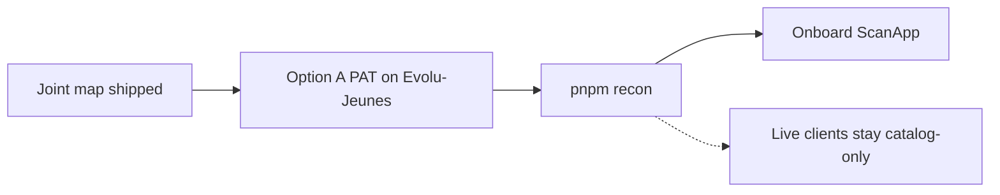

# PLAN — Cashtro × Evolu-Jeunes

1. Keep this joint map as the source of truth until GitHub trees appear.
2. Castro grants Option A (`docs/ACCESS_REQUIRED.md`).
3. Re-run recon. Replace `evolu-dark` with real private repo nodes.
4. Onboard ScanApp only. Do not touch live client production.
5. Self-improve work routes mentor-growth → leader-growth. Not a second OS.
